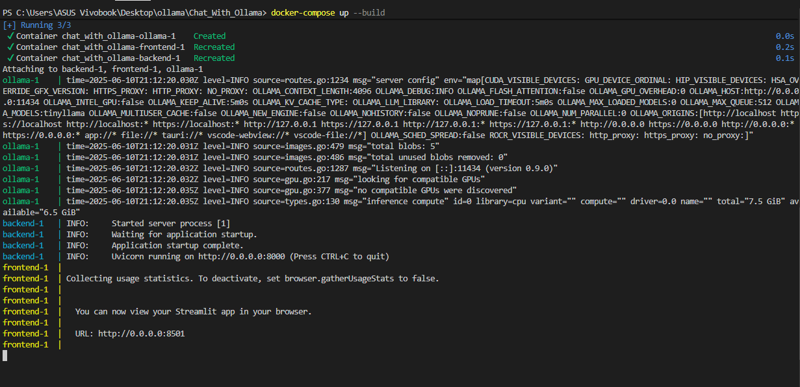
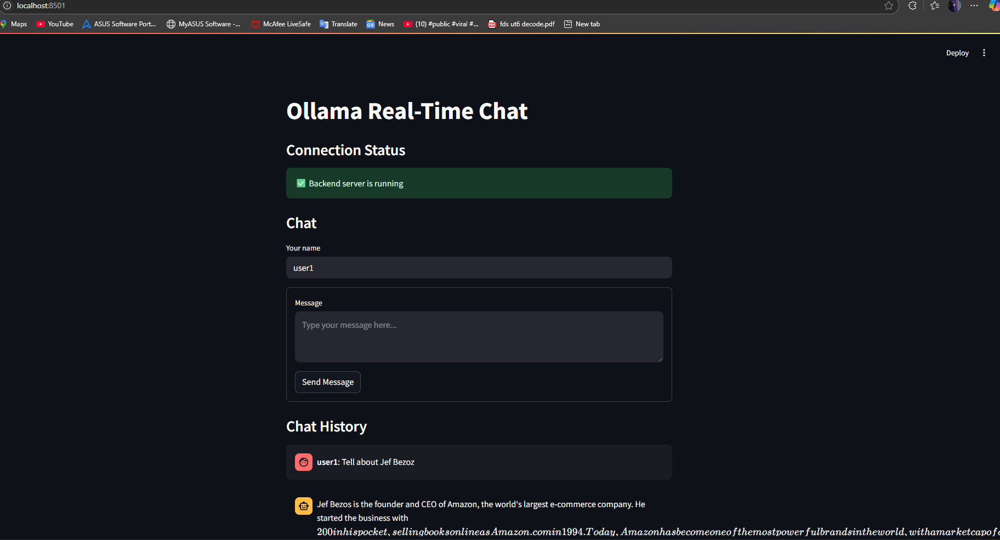
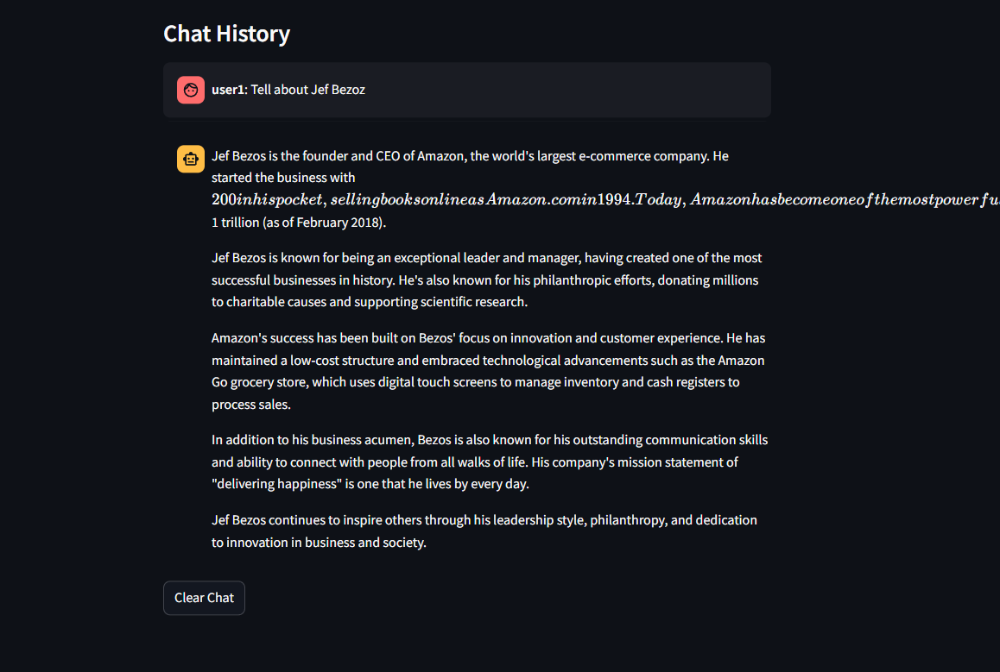

# Chat With Ollama (Real-Time Chat Application with Local LLM Integration)

## Features

- **Real-time messaging** with Socket.IO for asynchronous communication
- **Local LLM integration** using Ollama (with TinyLlama model)
- **Multi-user support** with individual chat sessions
- **Responsive UI** with Streamlit that shows connection and response status
- **Fully containerized architecture** for easy deployment
- **RESTful API endpoints** for programmatic access

## Screenshots

### How to Add Your Own Screenshots

1. Create an `images` folder in your repository (already done for you)
2. Take screenshots of your application:
   - Initial connection screen
   - Chat interface with user message
   - LLM response received
3. Save these screenshots in the `images` folder
4. Reference them in README.md using relative paths like this:

```markdown



```

Example result (sample images will display here once you add them):

### Connection Screen

*Initial screen where the user connects to the chat server*

### Chat Interface

*User sending a message and receiving a response from the LLM*

### LLM Response

*The LLM generates thoughtful responses in real-time*

## Architecture

The application follows a modern microservice architecture:

```
┌─────────────┐     ┌─────────────┐     ┌─────────────┐
│   Frontend  │◄────┤   Backend   │◄────┤    Ollama   │
│  (Streamlit)│     │  (FastAPI)  │     │    (LLM)    │
└─────────────┘     └─────────────┘     └─────────────┘
       ▲                   ▲                   ▲
       │                   │                   │
       └───────────────────┴───────────────────┘
                 Docker Compose
```

## Project Structure

```
Chat_With_Ollama/
├── backend/
│   ├── app.py                # FastAPI + Socket.IO backend
│   ├── Dockerfile            # Backend container definition
│   └── requirements.txt      # Python dependencies
├── frontend/
│   ├── app.py                # Streamlit frontend
│   ├── Dockerfile            # Frontend container definition
│   └── requirements.txt      # Python dependencies
├── docker-compose.yml        # Multi-container orchestration
└── README.md                 # Project documentation
```

## System Setup Instructions

### Prerequisites

- Docker Desktop (Latest version)
- Git
- 4GB+ RAM recommended
- 10GB+ free disk space (for Docker images and containers)

### Step 1: Install Docker

#### Windows
1. Download Docker Desktop from [https://www.docker.com/products/docker-desktop](https://www.docker.com/products/docker-desktop)
2. Run the installer and follow the instructions
3. Ensure WSL 2 is enabled if prompted
4. After installation, start Docker Desktop
5. Verify installation by running `docker --version` in PowerShell

#### macOS
1. Download Docker Desktop from [https://www.docker.com/products/docker-desktop](https://www.docker.com/products/docker-desktop)
2. Drag Docker to your Applications folder
3. Open Docker from Applications
4. Verify installation by running `docker --version` in Terminal

#### Linux
1. Run these commands to install Docker Engine:
   ```sh
   sudo apt-get update
   sudo apt-get install docker-ce docker-ce-cli containerd.io docker-buildx-plugin docker-compose-plugin
   ```
2. Start Docker: `sudo systemctl start docker`
3. Verify installation: `docker --version`
4. Install Docker Compose: `sudo apt-get install docker-compose`

### Step 2: Clone and Run the Application

1. **Clone the repository:**
   ```sh
   git clone <your-repo-url>
   cd Chat_With_Ollama
   ```

2. **Start the application:**
   ```sh
   docker-compose up --build
   ```
   This will:
   - Build all container images
   - Download the TinyLlama model (approx. 1.3GB)
   - Start all services
   - The first build may take several minutes

3. **Access the frontend:**
   Open [http://localhost:8501](http://localhost:8501) in your browser

4. **How to use:**
   - Click "Connect to Chat Server" to establish a connection
   - Enter your name and message
   - Click "Send" to chat with the LLM
   - Wait for the AI response (status will be displayed)

## Technical Details

- **Backend:** FastAPI with python-socketio for asynchronous communication
- **Frontend:** Streamlit with real-time updates and connection status
- **LLM:** Ollama running TinyLlama, a lightweight but capable language model
- **Communication:** WebSockets via Socket.IO for real-time bidirectional messaging
- **Containerization:** Docker with multi-stage builds and volume persistence

## Model Configuration

The application uses TinyLlama by default. To change the model:

1. Update the model name in `docker-compose.yml`:
   ```yaml
   environment:
     - OLLAMA_MODELS=<your-model-name>
   ```

2. Modify the model name in `backend/app.py`:
   ```python
   async with client.stream("POST", OLLAMA_API_URL, json={
       "model": "<your-model-name>", 
       "prompt": message,
       "stream": True
   })
   ```

## Stopping the Application

```sh
docker-compose down
```

To completely clean up all resources including volumes:
```sh
docker-compose down --rmi all --volumes
```

## Future Enhancements

- Chat history persistence
- User authentication
- Customizable model parameters
- Message streaming for real-time response display
- Web-based admin panel

---
